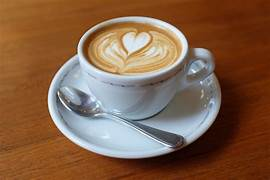
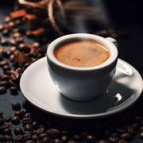

# Product description
* Coffe latte
  A latte or caffè latte is a milk coffee that boasts a silky layer of foam as a real highlight to the drink. A true latte will be made up of one or two shots of espresso, steamed milk and a final, thin layer of frothed milk on top.
  

* cappuccino coffee
  A cappuccino is a coffee drink made from a mixture of espresso and steamed milk. A traditional Italian cappuccino is generally a single (or sometimes a double) espresso shot topped with equal parts steamed and frothed milk.
  
  
* espresso coffee
  Espresso is a concentrated type of coffee drink with Italian origins. Prepared from the same coffee beans as regular coffee, it’s its preparation that differentiates espresso from regular coffee.
  Espresso features bold and concentrated coffee flavors and a velvety texture that are achieved through brewing under high pressure, typically 9 bars.
  
